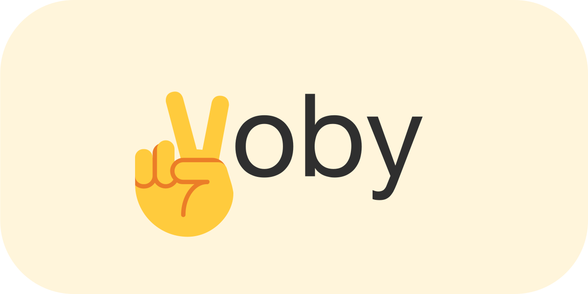

<p align="center">
  <a href="https://woby.dev">
    
  </a>
</p>

<p align="center">
  <a href="https://discord.gg/E6pK7VpnjC">
    
  </a>
  <a href="https://codesandbox.io/s/playground-7w2pxg">
    
  </a>
  <a href="https://opencollective.com/woby">
    
  </a>
</p>

# Woby Demos

This directory contains various demos showcasing the capabilities of the Woby framework.

## Available Demos

1. [Counter](demo/counter/README.md) - Basic counter component demonstrating custom elements, reactive properties, nested properties, style attributes, and context usage
2. [Counter SSR](demo/counter.ssr/README.md) - Server-side rendering version of the counter component
3. More demos coming soon...

## Documentation

For detailed documentation, please see:

- [Framework Documentation](docs/README.md)
- [Context API](docs/Context-API.md)
- [Installation Guide](docs/Installation.md)
- [Basic Demos Overview](docs/Basic-Demos.md)
- [Contributing Guide](docs/Contributing.md)

## Getting Started

To run the demos:

1. Ensure all dependencies are installed
2. Build the Woby framework
3. Serve the demo directory
4. Open in a web browser

Each demo directory contains its own README with specific instructions for running that demo.

# [Voby](https://woby.dev) Demo Projects

This repository contains demo projects showcasing the capabilities of the Woby framework.

## Demos

Each demo demonstrates different aspects of Woby's functionality:

- **[Benchmark](./demo/benchmark)** - Performance benchmarks
- **[Boxes](./demo/boxes)** - Animated 3D boxes using Three.js
- **[Clock](./demo/clock)** - Real-time digital clock
- **[Counter](./demo/counter)** - Simple counter application
- **[Emoji Counter](./demo/emoji_counter)** - Counter with emoji display
- **[HTML](./demo/html)** - Using HTML template literals
- **[HyperScript](./demo/hyperscript)** - Using HyperScript instead of JSX
- **[Playground](./demo/playground)** - Interactive playground
- **[Spiral](./demo/spiral)** - Animated spiral visualization
- **[Store Counter](./demo/store_counter)** - Counter using store-based state
- **[Triangle](./demo/triangle)** - Performance test with triangle rendering
- **[UIBench](./demo/uibench)** - UI performance benchmark

## Key Features Demonstrated

### Reactive State Management

All demos showcase Woby's fine-grained reactivity system using observables:

```typescript
import { $, $$ } from 'woby'

const count = $(0)  // Create reactive state
const increment = () => count(c => c + 1)  // Update state
```

### Advanced Class Management

Woby includes powerful built-in class management that supports complex class expressions similar to `classnames` and `clsx` libraries:

```typescript
// Array of classes
<div class={['red', 'bold']}>Text</div>

// Nested arrays
<div class={['red', ['bold', ['italic']]]}>Text</div>

// Mixed types with reactive expressions
<div class={[
  "base-class",
  () => ($$(value) % 2 === 0 ? "even" : "odd"),
  { hidden: true, italic: false },
  ['hello', ['world']]
]}>Complex classes</div>

// Object syntax for conditional classes
<div class={{
  'active': isActive,
  'disabled': isDisabled,
  'loading': isLoading
}}>Status element</div>
```

### Component Composition

Demos show various component patterns:

```typescript
import { customElement } from 'woby'

// Custom elements
customElement('my-counter', Counter, 'value')

// Higher-order components
const withLogging = (Component) => (props) => {
  console.log('Component rendered with props:', props)
  return <Component {...props} />
}
```

### Performance Optimizations

Woby's architecture eliminates the need for virtual DOM and provides automatic fine-grained updates:

- No VDOM overhead
- No stale closures
- No dependency arrays
- No props diffing
- No key props needed for lists

### Hooks and Utilities

Demos utilize Woby's comprehensive hook system:

```typescript
import { 
  useAnimationLoop, 
  useEventListener, 
  useInterval, 
  usePromise,
  useMemo
} from 'woby'

// Animation loops
useAnimationLoop((time) => {
  // Update animations
})

// Event listeners
useEventListener('resize', handleResize)

// Intervals
useInterval(() => {
  // Periodic updates
}, 1000)
```

## Getting Started

1. Clone this repository:
   ```bash
   git clone https://github.com/wongchichong/demo.git
   ```

2. Install dependencies:
   ```bash
   cd woby-demo
   pnpm install
   ```

3. Run any demo:
   ```bash
   cd demo/counter
   pnpm dev
   ```

## Live Examples

You can also view these demos online:

- **[Playground](https://codesandbox.io/s/playground-7w2pxg)** - Interactive environment
- **[Counter](https://codesandbox.io/s/demo-counter-23fv5)** - Basic counter
- **[Clock](https://codesandbox.io/s/demo-clock-w1e7yb)** - Real-time clock
- **[Boxes](https://codesandbox.io/s/demo-boxes-wx6rqb)** - Animated boxes
- **[Triangle](https://codesandbox.io/s/demo-triangle-l837v0)** - Performance test

## Documentation

For comprehensive documentation about Woby, visit:

- **[Official Documentation](https://github.com/wongchichong/woby/blob/main/docs/README.md)**
- **[API Reference](https://github.com/wongchichong/woby/blob/main/docs/Core-Methods.md)**
- **[Examples Guide](https://github.com/wongchichong/woby/blob/main/docs/Examples.md)**

## Contributing

Contributions are welcome! Please read our [contributing guidelines](https://github.com/wongchichong/woby/blob/main/docs/Contributing.md) before submitting pull requests.

## License

This project is licensed under the MIT License - see the [LICENSE](../LICENSE) file for details.